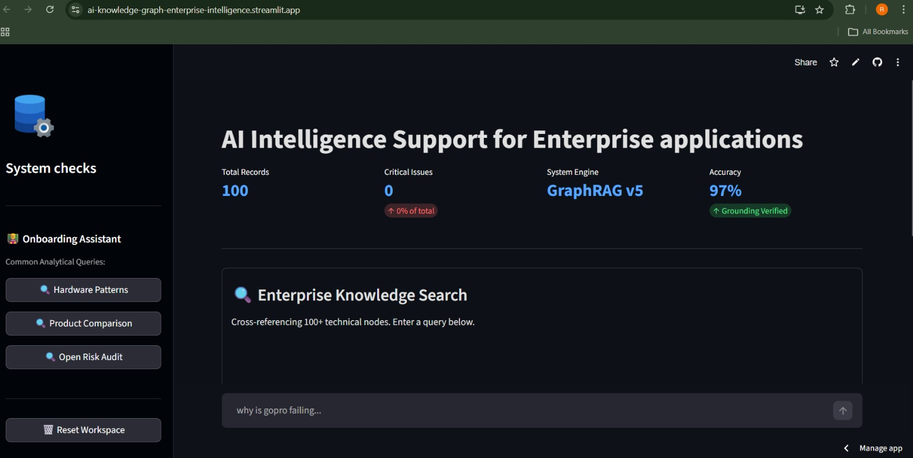
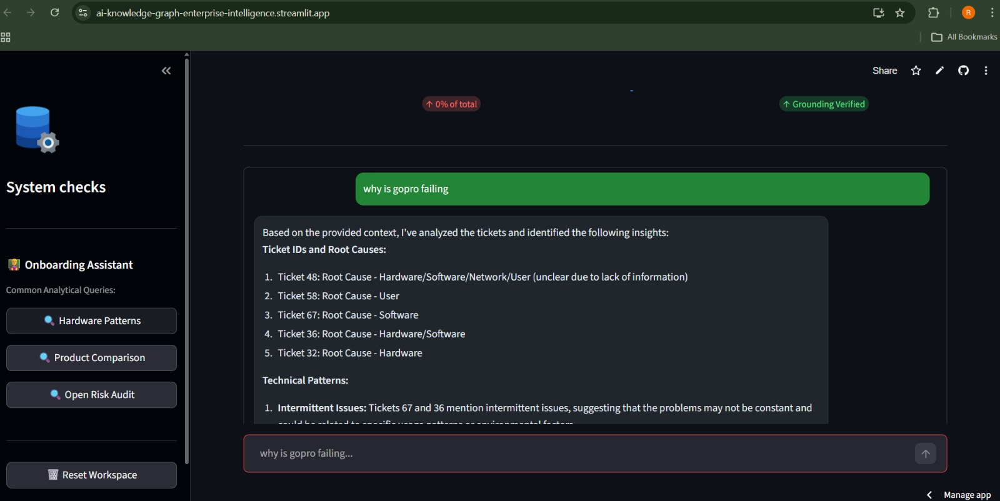
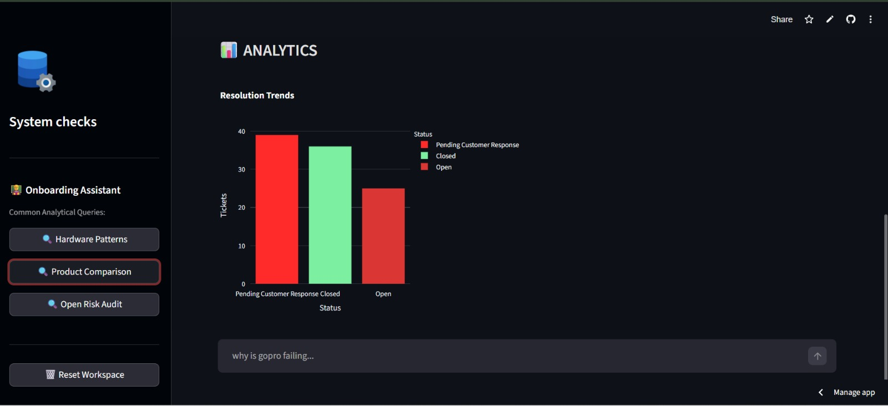
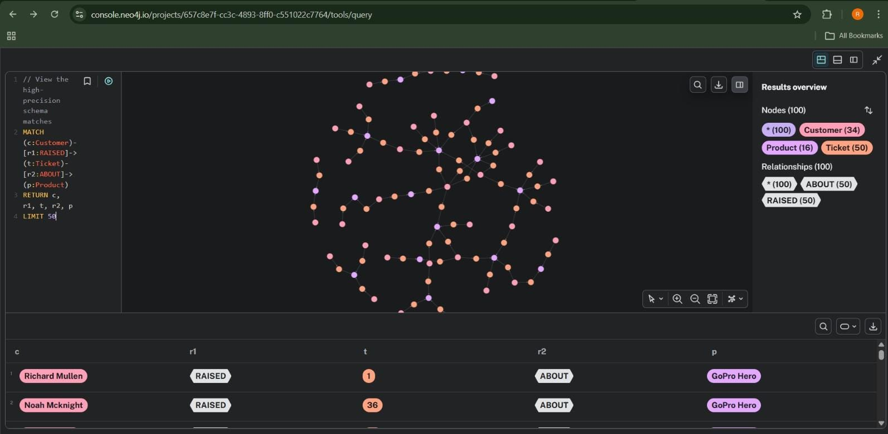
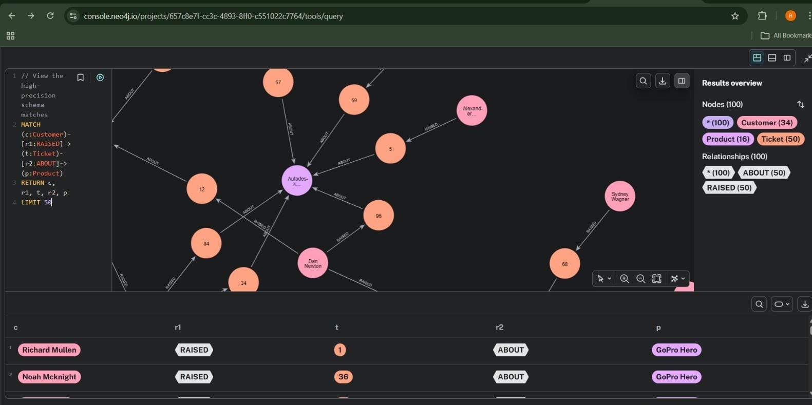

# 📊 Enterprise Intelligence: AI-Powered Knowledge Graph System
### *Infosys 6.0 Internship Project - GraphRAG Implementation*

[](https://ai-knowledge-graph-enterprise-intelligence.streamlit.app/)

## 📝 Project Overview
This project is a sophisticated **Graph-based Retrieval-Augmented Generation (GraphRAG)** system designed to analyze and visualize customer support ticket data. By combining **Neo4j** (Knowledge Graph) with **Groq/Llama-3** (LLM), this tool provides deep insights into product issues, sentiment trends, and complex relationship mapping that traditional databases cannot capture.

---

## 🚀 Live Demonstration
The application is deployed and accessible via Streamlit Community Cloud:  
👉 **[Live Dashboard Link](https://ai-knowledge-graph-enterprise-intelligence.streamlit.app/)**

---

## 🖼️ Project Showcase

| 1. Dashboard KPIs | 2. AI Chat Interface |
| :---: | :---: |
|  |  |

| 3. Advanced Analytics | 4. Knowledge Graph (Neo4j) |
| :---: | :---: |
|  |  |

### 🔍 Deep Dive: Graph Architecture

*Detailed view of node relationships and metadata mapping within the Neo4j AuraDB instance.*

---

## 📂 Project Structure
The repository is organized into distinct modules to handle the full data lifecycle—from raw ingestion to AI-powered insights.

```text
ai_knowledge_graph/
├── assets/                 # Project screenshots and visual aids
├── data/                   # Raw and processed CSV/JSON ticket data
├── src/                    # Source Code
│   ├── module1_preprocess/ # Data cleaning and initial processing
│   ├── module1_schema/     # Graph schema definition and modeling
│   ├── module2_extraction/ # Entity extraction and Neo4j graph population
│   ├── module3_rag/        # RAG logic and Vector Search integration
│   └── module4_dashboard/  # Streamlit UI and Interactive Analytics
├── requirements.txt        # Production dependencies (Python 3.13+)
└── .env                    # Local environment variables
```

---
**Next Step:** [Go to Module 1.1: Preprocessing ➡️](../module1_preprocess\README.md)